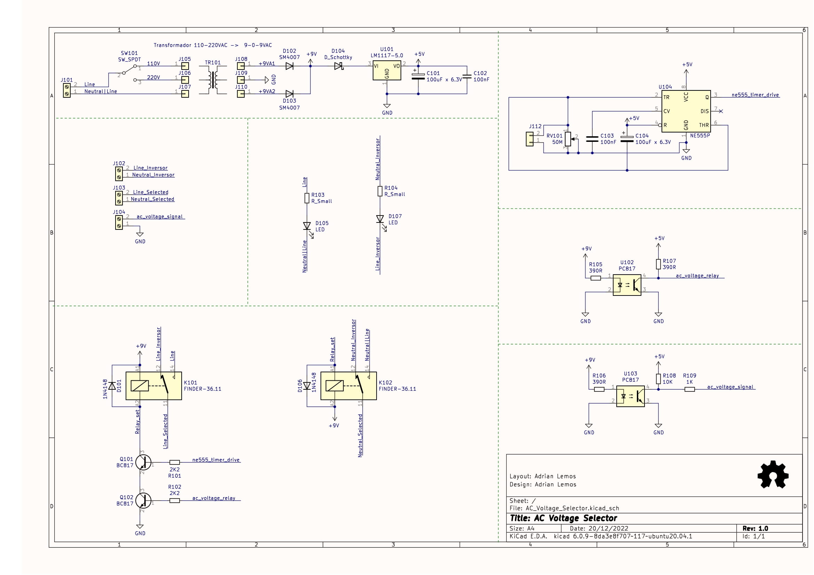
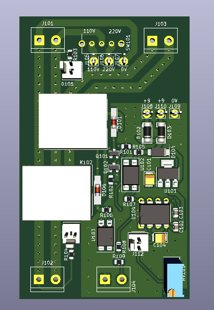
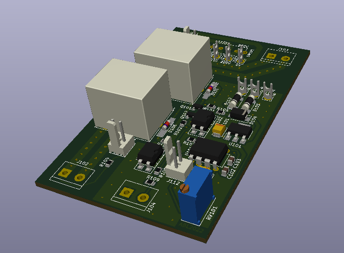
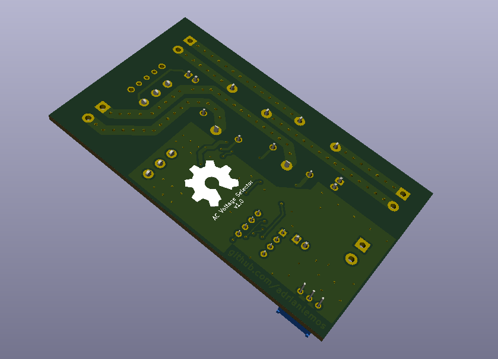

## Selecione o Idioma: | Português  | [Inglês](README_en.md) | [Espanhol](README_es.md)  |

## Observação
Este projeto apesar de possuir o README em três idiomas ele será sempre atualizado em português primeiro. 

# Nome do Projeto

<!-- Table of Contents -->

<!-- End of Conttents -->

# Descrição

## Schematico

## 3D Imagens
  

# Começando

## Dependencias

### Programas utilizados
- Schematic and PCB Layout
  - Kicad 6.0.2

# Autor

## Historico de Versão

# Licensa

# Bibliografia e links externoss
